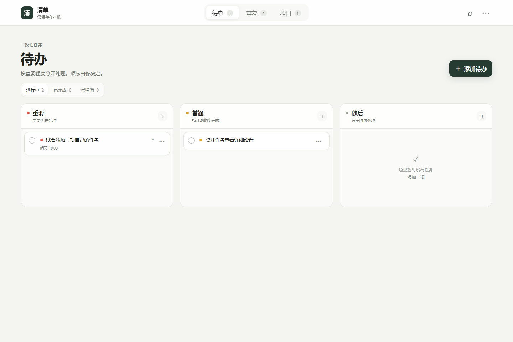
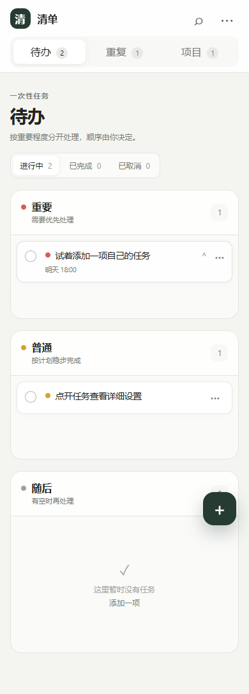

# 清单 Qingdan

一个轻量、本地优先、可自托管同步的个人工作清单，重点照顾 Windows 与 Android/HarmonyOS 的提醒可靠性。

当前公开准备版本：`0.5.0 Beta`





## 为什么做清单

清单把一次性待办、重复任务和项目分成三个独立模块，避免功能堆叠。所有编辑先保存在本机，断网时仍能工作；需要跨设备时，可连接自己的 Supabase 项目。

## 主要能力

- 重要、普通、随后三级优先级
- 快速添加、编辑、置顶、完成、取消、恢复和永久删除
- 任务节点、备注、单次提醒和时间段循环提醒
- “明天 / 后天 / 下周”快速延后
- 重复任务及本次完成/跳过
- 多级项目和项目内部任务
- 搜索、本地持久化和离线 PWA
- Supabase 邮箱账号与本地优先同步
- Windows 置顶窗口、系统托盘和后台提醒
- Android/HarmonyOS 精确提醒、重启恢复和桌面小组件
- Windows 与手机应用内更新通道

## 支持平台

| 平台 | 状态 | 说明 |
| --- | --- | --- |
| Web / PWA | 可用 | 现代浏览器，离线缓存 |
| Windows | 已实机验证 | .NET 8、Edge WebView2、托盘和后台提醒 |
| Android | 已实机验证 | Android 8.0（API 26）及以上 |
| HarmonyOS | 已实机验证 | 华为 Pura 70 Pro / HarmonyOS 4.2 兼容 Android APK |

> 当前 HarmonyOS 版本是 Android APK 兼容路线，不是 HarmonyOS NEXT 原生应用。

## 下载与安装

仓库公开后，正式安装包应放在 GitHub **Releases**，不要从源码目录里的历史归档安装。

- Windows：下载桌面 ZIP，完整解压后运行 `Qingdan.exe`；正式包已包含 .NET 运行时。
- Android/HarmonyOS：下载正式签名 APK，安装时按系统提示授予通知和精确闹钟权限。

Windows 用户也可以双击 `创建桌面快捷方式.vbs` 创建稳定快捷方式。只要项目目录不移动，后续重新构建不需要更换快捷方式。

## 运行 Web 版

Web 版没有运行时框架依赖，但必须通过 HTTP 提供文件，不能直接双击 `index.html`：

```powershell
python -m http.server 4173
```

然后访问 <http://localhost:4173>。

## 开发与测试

需要 Node.js 22 或更高版本。安装依赖并运行测试：

```powershell
pnpm install --frozen-lockfile
pnpm test
```

桌面端需要 .NET 8 SDK 和 Edge WebView2：

```powershell
dotnet restore desktop/Qingdan.Desktop/Qingdan.Desktop.csproj
dotnet build desktop/Qingdan.Desktop/Qingdan.Desktop.csproj -c Release
```

手机端需要 JDK 17、Android SDK 35 和 Gradle 8.9。详细步骤见 [mobile/README.md](mobile/README.md)，桌面说明见 [desktop/README.md](desktop/README.md)。

## 自托管同步

1. 创建 Supabase 项目。
2. 在 SQL Editor 运行 `supabase/migrations/001_initial_sync.sql`；需要自建发布通道时再运行 `002_mobile_releases.sql`。
3. 在应用设置中填写 Project URL 和 **Publishable key**。
4. 注册或登录邮箱账号。

不要把数据库密码、Secret key 或 `service_role` key 填入应用。同步表启用了 Row Level Security，每个账户只能访问自己的数据。完整说明见 [supabase/README.md](supabase/README.md) 和 [docs/SYNC.md](docs/SYNC.md)。

## 官方更新源

数据同步地址和软件更新地址是两个不同的信任边界。当前官方发行版在 `src/release-config.js` 中固定使用以下 GitHub Release 更新清单：

```text
https://github.com/mmcc65/qingdan/releases/latest/download/desktop-latest.json
https://github.com/mmcc65/qingdan/releases/latest/download/latest.json
```

二次开发者可以替换这两个地址。配置为空时，旧安装会暂时兼容使用用户 Supabase 的 `qingdan-releases` 桶。

## 数据与隐私

- 未配置同步时，任务仅存放在设备本地。
- 配置 Supabase 后，账户信息由所选 Supabase 项目处理，任务数据写入该项目。
- 项目不内置广告、分析 SDK 或行为追踪。
- 卸载或清除浏览器/应用数据可能删除尚未同步的本地任务。

详见 [PRIVACY.md](PRIVACY.md)。

## 项目结构

```text
src/        Web 核心、同步和发布配置
desktop/    Windows WPF + WebView2 外壳
mobile/     Android/HarmonyOS 兼容外壳
supabase/   数据同步与发布桶迁移
tests/      核心逻辑和响应式 UI 检查
tools/      构建、安装和发布脚本
docs/       产品、同步和架构文档
```

## 当前限制

- 云同步是第一版实体同步，复杂的跨设备同时编辑仍需更细致的冲突处理。
- Windows 安装包尚未提供商业代码签名，系统可能显示未知发布者提示。
- 自动更新的 SHA-256 只能验证下载完整性；广泛分发前应增加独立签名验证或平台代码签名。
- 暂不支持图片、视频和大型附件。

## 参与项目

提交问题或代码前请阅读 [CONTRIBUTING.md](CONTRIBUTING.md)。安全问题请按 [SECURITY.md](SECURITY.md) 私下报告，不要公开包含漏洞细节的 Issue。

## 许可证

本项目采用 [MIT License](LICENSE)。
